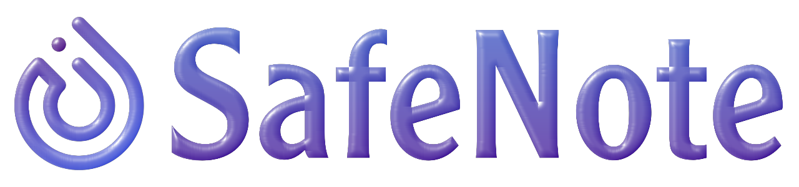

safenote<div align="center">
<a href="https://www.devdisplay.org/"></a><br>

`The safest workspace to store and share your private notes & messages!`

<h2 align="center"><a href="https://www.safenote.me/"><strong>✦ www.safenote.me ✦</strong></a><br><br>F*ck Authentication! No Logins. No Signups. <br>Your data is fully encrypted and only accessible by you.</h2>

<a href="https://www.producthunt.com/products/safenote-2?embed=true&utm_source=badge-featured&utm_medium=badge&utm_source=badge-safenote&#0045;2" target="_blank"></a>
<hr>
</div>

## ✨ Features

### 🔒 **Secure Workspaces**
- **Username-based Access**: No email required - just pick a username
- **Password Protection**: Strong encryption for all your private content
- **Private Workspaces**: Each user gets their own isolated environment
- **No Tracking**: Your data stays private and secure

### 🌐 **Sharing & Collaboration**
- **Secure Sharing**: Share workspace links with password protection
- **Public Paste Links**: Generate shareable links for individual notes
- **Copy to Clipboard**: One-click content copying
- **Social Sharing**: Share via multiple platforms

### 📝 **Smart Note Management**
- **Rich Text Support**: Create detailed notes with full formatting
- **Real-time Search**: Find your notes instantly with live search
- **Easy Organization**: Categorize and manage your content efficiently
- **Version History**: Track changes and maintain note versions

### 🚀 **Modern User Experience**
- **Progressive Web App (PWA)**: Install on any device for native app experience
- **Responsive Design**: Perfect on desktop, tablet, and mobile
- **Dark Theme**: Easy on the eyes with beautiful dark interface
- **Instant Loading**: Lightning-fast performance with Vite

### 🎯 **Advanced Features**
- **CRUD Operations**: Full Create, Read, Update, Delete functionality
- **Real-time Updates**: Live synchronization across devices
- **Offline Support**: Access your notes even without internet
- **Analytics**: Built-in Vercel Analytics for performance monitoring

---

<!--
## 🚀 Quick Start

### Prerequisites
- Node.js 18+ 
- npm or yarn
- Supabase account (for database)

### Installation

```bash
# Clone the repository
git clone https://github.com/codeaashu/safenote.git

# Navigate to project directory
cd safenote

# Install dependencies
npm install

# Set up environment variables
cp .env.example .env.local
# Add your Supabase credentials

# Run development server
npm run dev
```

### Environment Setup

Create a `.env.local` file in the root directory:

```env
VITE_SUPABASE_URL=your_supabase_url
VITE_SUPABASE_ANON_KEY=your_supabase_anon_key
```

### Database Setup

Run the SQL scripts in your Supabase dashboard:

1. Execute `database_setup.sql` to create tables
2. Run `enable-rls-properly.sql` for security policies

---
-->

## 🏗️ Tech Stack

### **Frontend**
- **⚡ Vite** - Lightning-fast build tool and dev server
- **⚛️ React 18** - Modern UI library with hooks and concurrent features
- **🎨 Tailwind CSS** - Utility-first CSS framework
- **🧩 shadcn/ui** - Beautiful, accessible component library
- **📱 Radix UI** - Unstyled, accessible UI primitives

### **State Management**
- **🗃️ Redux Toolkit** - Efficient state management
- **🔄 React Router** - Declarative routing for React
- **🌐 React Redux** - Official React bindings for Redux

### **Backend & Database**
- **🐘 Supabase** - Open source Firebase alternative
- **🔒 Row Level Security** - Database-level security policies
- **📊 PostgreSQL** - Robust relational database

### **PWA & Performance**
- **📱 Vite PWA Plugin** - Progressive Web App capabilities
- **⚡ Workbox** - Service worker and caching strategies
- **📈 Vercel Analytics** - Performance and user analytics
- **🔥 React Hot Toast** - Beautiful notifications

### **UI/UX Libraries**
- **🎭 Lucide React** - Beautiful icon library
- **🎨 Class Variance Authority** - CSS-in-JS utility
- **🔧 clsx & tailwind-merge** - Conditional className utilities
- **📤 React Share** - Social media sharing components

### **Development Tools**
- **🔍 ESLint** - Code linting and formatting
- **🎯 TypeScript Support** - Type definitions included
- **📦 PostCSS** - CSS transformations
- **🔧 Autoprefixer** - Automatic CSS vendor prefixing

<!--
---

## 📁 Project Structure

```
safenote/
├── 📁 public/                    # Static assets
│   ├── favicon.ico
│   ├── safenote.png
│   └── *.png                     # Various logo variants
├── 📁 src/
│   ├── 📁 components/            # React components
│   │   ├── 📁 ui/               # shadcn/ui components
│   │   ├── Hero.jsx             # Landing page hero
│   │   ├── UserWorkspace.jsx    # User workspace interface
│   │   ├── CreateWorkspace.jsx  # Workspace creation
│   │   ├── ViewPaste.jsx        # Individual note viewer
│   │   └── PWAInstallPrompt.jsx # PWA installation prompt
│   ├── 📁 contexts/             # React contexts
│   │   └── AuthContext.jsx     # Authentication context
│   ├── 📁 features/             # Redux features
│   │   ├── PasteSlice.js        # Paste state management
│   │   └── PasteThunks.js       # Async actions
│   ├── 📁 lib/                  # Utility libraries
│   │   ├── supabaseClient.js    # Database client
│   │   └── utils.js             # Helper functions
│   ├── 📁 store/                # Redux store
│   │   └── store.js             # Store configuration
│   ├── App.jsx                  # Main application component
│   ├── main.jsx                 # Application entry point
│   └── index.css                # Global styles
├── 📄 database_setup.sql        # Database schema
├── 📄 vite.config.js            # Vite configuration
├── 📄 tailwind.config.js        # Tailwind configuration
├── 📄 components.json           # shadcn/ui configuration
└── 📄 vercel.json               # Deployment configuration
```

--- -->

<!-- ## 🛠️ Available Scripts

```bash
# Development
npm run dev          # Start development server
npm run preview      # Preview production build

# Production
npm run build        # Build for production
npm run lint         # Run ESLint

# Testing
npm run test         # Run test suite (if configured)
```

---

## 🚀 Deployment

### Vercel (Recommended)
1. Connect your GitHub repository to Vercel
2. Add environment variables in Vercel dashboard
3. Deploy automatically on every push

### Manual Deployment
```bash
# Build the project
npm run build

# Deploy the dist/ folder to your hosting provider
```

---

## 🔒 Security Features

- **🛡️ Row Level Security (RLS)** - Database-level access control
- **🔐 Password Hashing** - Secure password storage
- **🚫 No Session Storage** - Stateless authentication
- **🔒 Environment Variables** - Secure API key management
- **🌐 HTTPS Only** - Secure data transmission

---

## 🤝 Contributing

We welcome contributions! Please follow these steps:

1. **Fork the repository**
2. **Create a feature branch**: `git checkout -b feature/amazing-feature`
3. **Commit your changes**: `git commit -m 'Add amazing feature'`
4. **Push to the branch**: `git push origin feature/amazing-feature`
5. **Open a Pull Request**

### Development Guidelines

- Follow the existing code style
- Write meaningful commit messages
- Test your changes thoroughly
- Update documentation as needed

---

## 📝 License

This project is licensed under the MIT License - see the [LICENSE](LICENSE) file for details.

---

## 🙏 Acknowledgments

- **shadcn/ui** - For the beautiful component library
- **Supabase** - For the robust backend infrastructure
- **Vercel** - For seamless deployment and analytics
- **Tailwind CSS** - For the utility-first styling approach
-->

---

## 📧 Support

- 🐛 **Bug Reports**: [Create an Issue](https://github.com/codeaashu/safenote/issues)
- 💡 **Feature Requests**: [Implement new features](https://github.com/codeaashu/safenote/issues/new)

---

<h1 align="center"> Give us a Star and let's make magic! </h1>

<div align="center">
    <a href="#top">
        
    </a><br>
     
</div>

